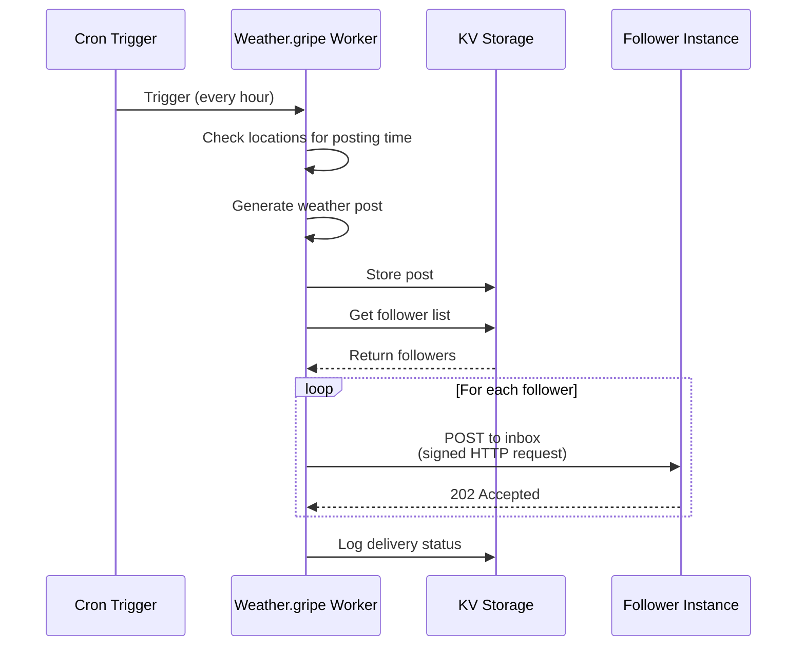
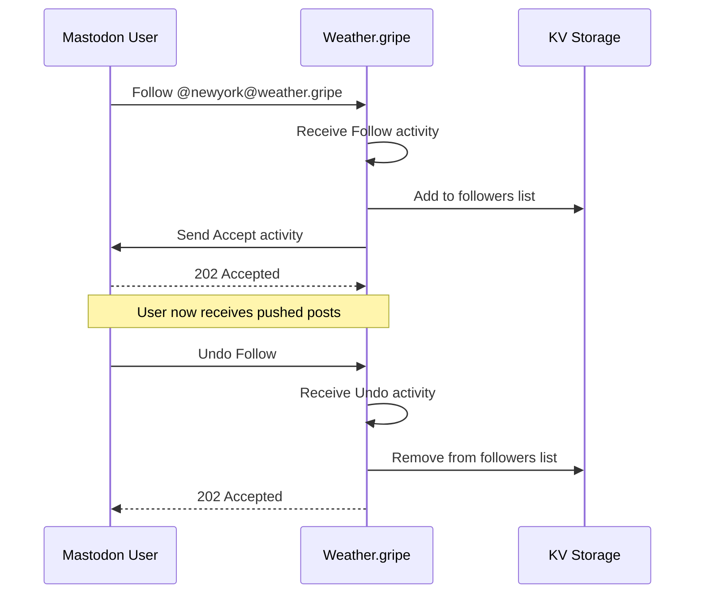

# ActivityPub Push Delivery System

## Overview

ActivityPub is a **push-based** protocol where content creators actively deliver posts to their followers' inboxes, rather than followers pulling content. This document explains how our weather service implements this push delivery system.

## Key Components

### 1. Delivery Service (`src/services/delivery-service.js`)

The core service responsible for pushing content to followers:

- **`deliverPostToFollowers()`** - Sends posts to all follower inboxes
- **`deliverToInbox()`** - Delivers a single activity to one inbox
- **`handleFollow()`** - Processes new follows and sends Accept
- **`handleUnfollow()`** - Removes unfollowed users
- **`processDeliveryQueue()`** - Handles async/batched deliveries

### 2. Inbox Handler

Receives and processes incoming activities:

- **Follow** - Someone wants to follow a location
- **Undo Follow** - Someone unfollows
- **Delete** - Remote account deletion

### 3. Scheduled Push Delivery

The cron handler (`scheduled()` in `index.js`) runs every hour to:

1. Check which locations need posts (7am, noon, 7pm local time)
2. Generate weather posts for those locations
3. **Push posts to all followers of each location**
4. Process any queued deliveries

## Push Delivery Flow



## Follow/Unfollow Flow



## Delivery Implementation Details

### Batch Processing

To avoid overwhelming the system and respect rate limits:

```javascript
const BATCH_SIZE = 10; // Adjust based on limits
const batches = chunkArray(followers, BATCH_SIZE);

for (const batch of batches) {
  await Promise.allSettled(
    batch.map(inbox => deliverToInbox(inbox, activity))
  );
}
```

### Idempotent Delivery

Posts use deterministic IDs to prevent duplicates:

```javascript
const postId = generatePostId(location, time, type);
if (!await WeatherPost.exists(postId, env)) {
  // Safe to create and deliver
}
```

### Delivery Queue

Failed deliveries are queued for retry:

```javascript
await queueDelivery({
  inbox: followerInbox,
  activity: post,
  attempts: 0,
  nextRetry: Date.now() + 60000 // Retry in 1 minute
});
```

### HTTP Signatures

All deliveries are signed for authentication (TODO: Implement):

```javascript
const signedHeaders = await signRequest(
  url, 
  method, 
  headers, 
  body, 
  actorPrivateKey
);
```

## Storage Requirements

### KV Namespaces

- **FOLLOWERS** - List of followers per location with inbox URLs
- **POSTS** - Historical posts (for idempotency)
- **DELIVERY_QUEUE** - Failed deliveries for retry
- **ALERTS** - Active alert tracking

### Follower Storage Format

```json
{
  "id": "https://mastodon.social/@user",
  "inbox": "https://mastodon.social/users/user/inbox",
  "sharedInbox": "https://mastodon.social/inbox",
  "addedAt": "2025-01-15T12:00:00Z"
}
```

## Performance Considerations

### Delivery Optimization

1. **Shared Inboxes** - Deduplicate deliveries to the same server
2. **Concurrent Delivery** - Process batches in parallel
3. **Caching** - Cache remote actor data to avoid repeated fetches
4. **Queue Processing** - Handle failures asynchronously

### Scale Limits

| Metric | Limit | Mitigation |
|--------|-------|------------|
| Followers per location | 10,000+ | Pagination, shared inboxes |
| Deliveries per second | ~100 | Batch processing, queuing |
| KV operations | 1000/sec | Caching, batch reads |
| Concurrent requests | 50 | Request pooling |

## Error Handling

### Delivery Failures

- **4xx errors** - Don't retry (bad request, not found)
- **5xx errors** - Queue for retry with exponential backoff
- **Network errors** - Queue for immediate retry
- **Rate limits** - Queue with delay

### Follower Cleanup

Automatically remove followers when:
- Their instance sends a Delete activity
- Delivery fails repeatedly (after N attempts)
- Instance is permanently unreachable

## Testing Push Delivery

### Local Testing

```bash
# Simulate a Follow activity
curl -X POST http://localhost:8787/locations/newyork/inbox \
  -H "Content-Type: application/activity+json" \
  -d '{
    "@context": "https://www.w3.org/ns/activitystreams",
    "type": "Follow",
    "actor": "https://test.example/users/alice",
    "object": "https://weather.gripe/locations/newyork"
  }'
```

### Verify Delivery

Check logs for delivery attempts:
```bash
npx wrangler tail --format pretty
```

## Future Enhancements

1. **Cloudflare Queues** - Replace KV-based queue with native queuing
2. **Delivery Reports** - Track delivery success rates per instance
3. **Smart Retry** - Adaptive retry based on instance reliability
4. **Priority Delivery** - Prioritize active followers
5. **Webhook Support** - Alternative delivery mechanism
6. **Delivery Receipts** - Track read receipts where supported

## Compliance

Our push implementation follows:
- [ActivityPub W3C Specification](https://www.w3.org/TR/activitypub/)
- [HTTP Signatures Draft](https://datatracker.ietf.org/doc/html/draft-cavage-http-signatures)
- Mastodon's implementation quirks
- Rate limiting best practices